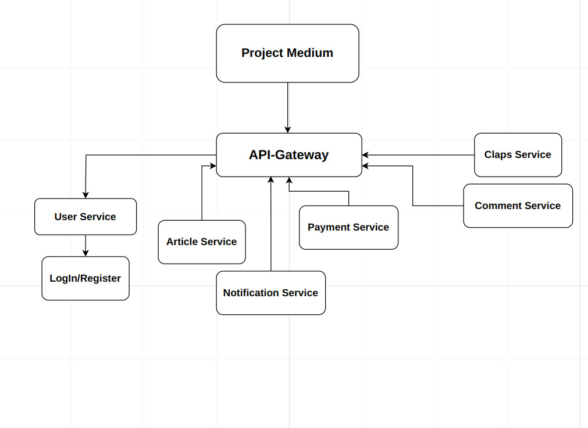

# Medium-Project

Medium-Project - bu mikroservis arxitekturasi asosida qurilgan loyiha bo‘lib, foydalanuvchilarga maqolalar yozish, ularga izohlar qoldirish, maqolalarni yoqtirish va to‘lovlar amalga oshirish imkonini beradi.

## Texnologiyalar

- **Dasturlash tili**: Go (Golang)
- **Aloqa protokoli**: gRPC
- **Ma’lumotlar bazasi**: PostgreSQL

## Loyiha komponentlari

### API Gateway
- **Vazifasi**: Barcha xizmatlarga kirishni boshqaradi va talablarni tegishli xizmatlarga yo‘naltiradi.

### User Service
- **Vazifasi**: Foydalanuvchilarni boshqarish (ro‘yxatdan o‘tish, tahrirlash, o‘chirish).
- **Aloqadorlik**: Login/Register xizmatiga ulangan.

### Login/Register Service
- **Vazifasi**: Foydalanuvchilarni ro‘yxatdan o‘tkazish va tizimga kirish funksiyalari.

### Article Service
- **Vazifasi**: Maqolalarni boshqarish (yaratish, o‘chirish, tahrirlash).

### Notification Service
- **Vazifasi**: Foydalanuvchilarga bildirishnomalar yuborish.

### Payment Service
- **Vazifasi**: O'z profilingizni Pro versiyaga o'tkazib olish uchun to'lovlarni amalga oshirish.

### Claps Service
- **Vazifasi**: Maqolalarni va ulardagi sharhga qarsak chalish funksiyalari.
- **Boshqa social medialardagi like dan farqi**: Clapc tugmasini bir necha marotaba bossa bo'ladi

### Comment Service
- **Vazifasi**: Maqolalarga izohlar qoldirish funksiyalari.

